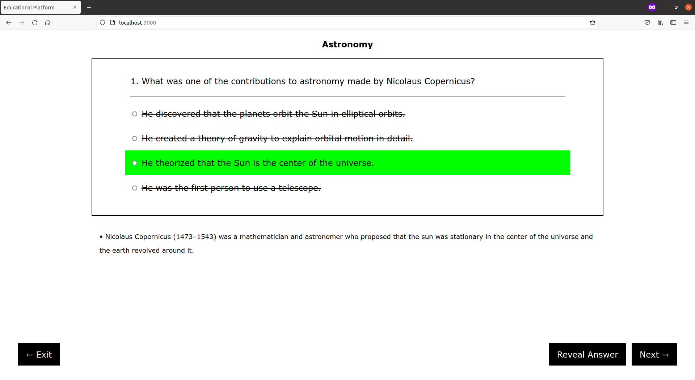

# Open Source Collage Question Feature

## Introduction

This platform aims to educate students on various subjects through problem solving. It features core academic disciplines, as well as topics students normally wouldn't encounter in typical class settings. With thorough explanations and detailed score report, students can recognize their strengths, and better understand areas on which they need to improve.

I plan to integrate this technology onto my existing web application, Open Source Collage. (I am keeping it separate for now, and once it's complete, I will merge it to the project). 

## Structure

This app is front-end only at the moment, although I could choose to easily add the backend components, and integrate things like database of problems and solutions, as well as a login system. The front-end is `react-create-app` and inside the src folder is `App.js` which contains everything. Styling is done through normal css and all rules are defined in `style.css`. Questions are organized in JSON format by the subject (found inside data folder).
